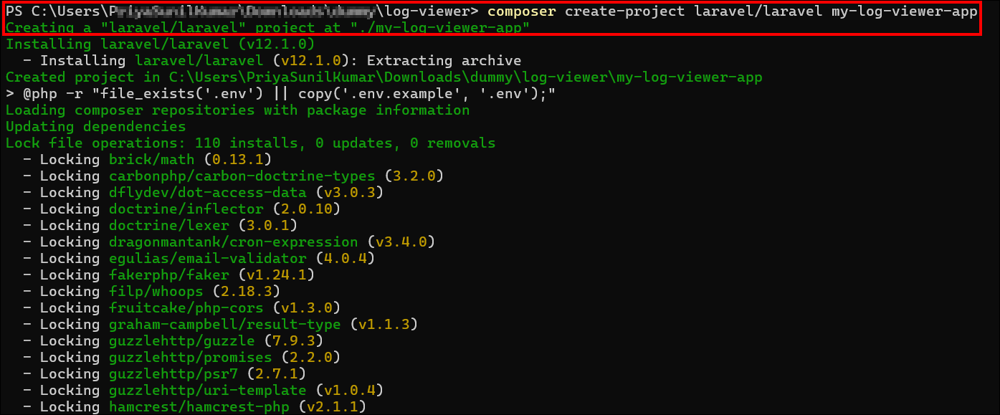
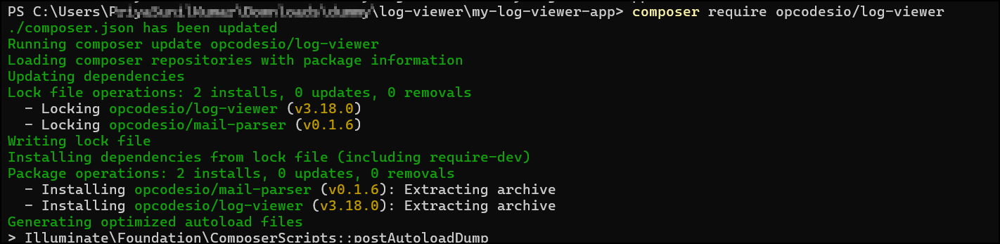
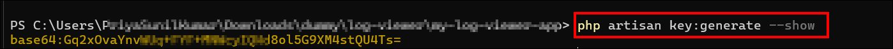
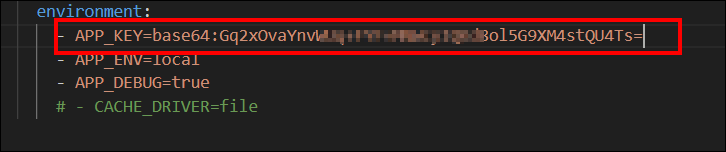
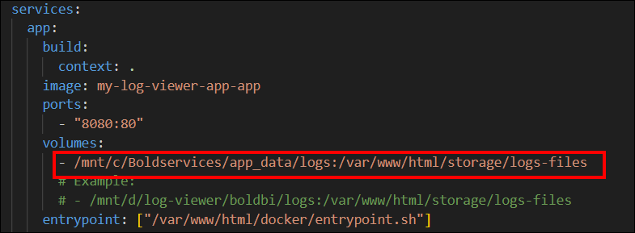
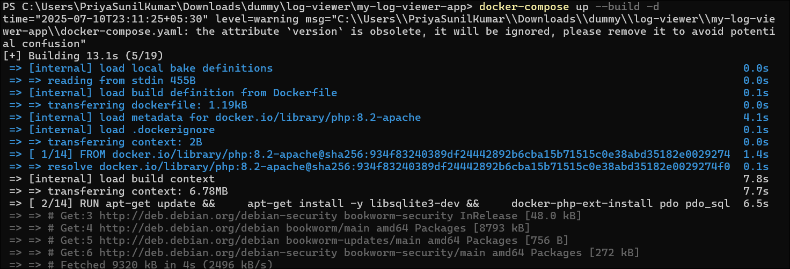
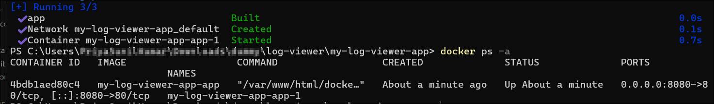
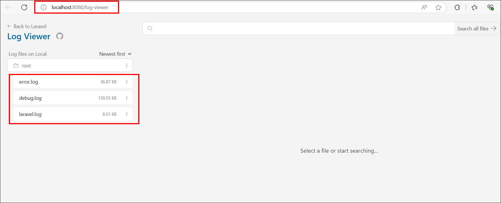

# Logs Explorer using log-viewer

---

## Overview of log-viewer

**log-viewer** is an **open-source** package for Laravel that lets you easily view and search your application logs right in the browser.  

It has a clean, responsive interface and helps developers quickly find errors or debug issues without needing to open log files manually on the server.  

Key features (from the official source):  
- Beautiful, responsive UI.  
- Powerful filtering and search.  
- Automatic log file discovery.  
- Support for large log files.  
- No data sent to any third-party service.

For more details, see the official repository:  
👉 [opcodesio/log-viewer on GitHub](https://github.com/opcodesio/log-viewer)

---

## License

This application is released under the **MIT License**.  

You can read the full license text here:  
👉 [MIT License - log-viewer](https://github.com/opcodesio/log-viewer/blob/main/LICENSE.md)

---

## How to Build and Deploy this Application

This section explains how to build your own Laravel-based **log-viewer** deployment using Docker.

---

### Prerequisites

Ensure you have these installed on your system:

1. **Docker**  
   - [Official installation guide](https://docs.docker.com/get-docker/)

2. **Composer**  
   - [Official download page](https://getcomposer.org/download/)

3. **PHP**  
   - [Official Windows downloads](https://windows.php.net/download)  
   - [Official PHP site for other systems](https://www.php.net/downloads)

---

### Steps to Build and Deploy the Application

1. **Clone the Deployment Repository**:

   Clone the below given deployment repository to get the preconfigured Docker and setup files:

   ```bash
   git clone https://github.com/sivakumar-devops/log-viewer
   cd log-viewer
   ```
2. **Create a New Laravel Project**:

    On your host machine, create a new Laravel application:

    ```bash
    composer create-project laravel/laravel my-log-viewer-app
    cd my-log-viewer-app
    ```
    

3. **Install the log-viewer package**:

    Add the `opcodesio/log-viewer` package to your Laravel project:

    ```bash
    composer require opcodesio/log-viewer
    ```
    

4. Copy the following files and folder from the cloned repository (from step 1) into your new Laravel project (my-log-viewer-app):

    `docker/ folder`

    `Dockerfile`

    `docker-compose.yaml`

5. **Generate the application key**:

    Inside your Laravel project directory, generate the application key:

    ```bash
    php artisan key:generate --show
    ```

    

6. **Configure the App Key**:

    Copy the generated key and update it in your .env file or docker-compose.yaml under the APP_KEY environment variable.

    

7. **Update Volume Path for Log Files**:

    In docker-compose.yaml, configure the volume to point to your actual Bold BI logs directory:
    Example:

    ```bash
    volumes:
    - /path/to/boldbi/logs:/var/www/html/storage/logs-files
    ```

    

8. **Build and Start the Container**: 

    Run the following command to build the image and start the container in detached mode:

    ```bash
    docker-compose up --build -d
    ```

    

    

9. **Access the Log Viewer**:

    Open your browser and navigate to:

    ```bash
    http://localhost:8080/log-viewer
    ```
    

**Notes:**

- Ensure that the mapped logs directory `(/path/to/boldbi/logs)` has appropriate read permissions for the container.

- To stop the container, use:

    ```bash
        docker-compose down 
    ```
- You can customize the Dockerfile and docker-compose settings as needed for your environment.

